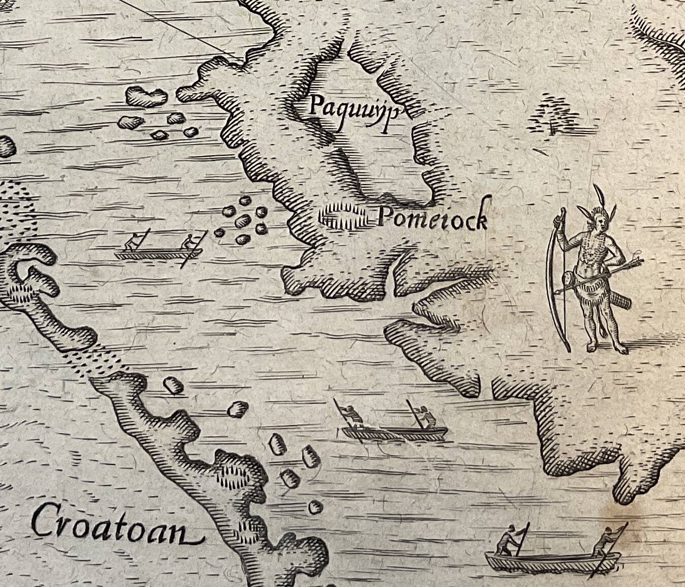
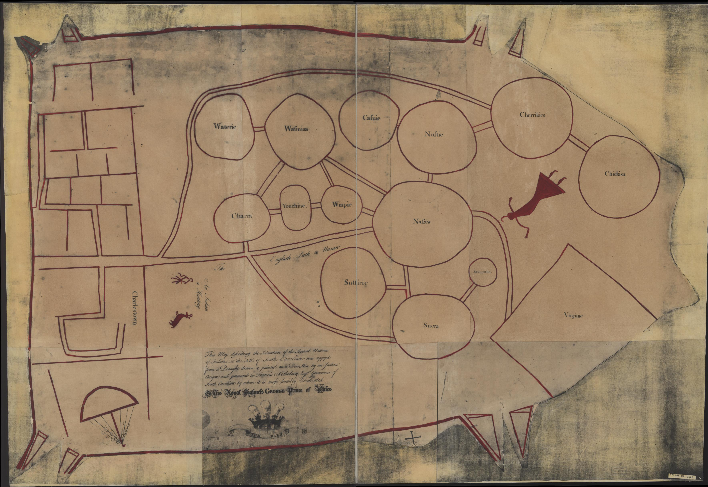
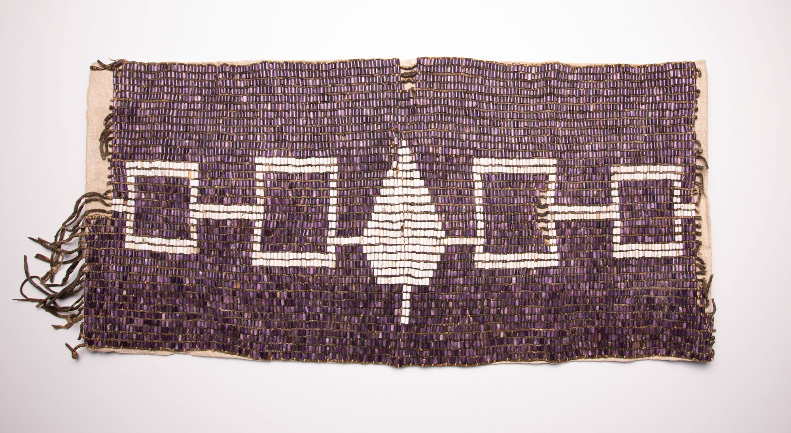
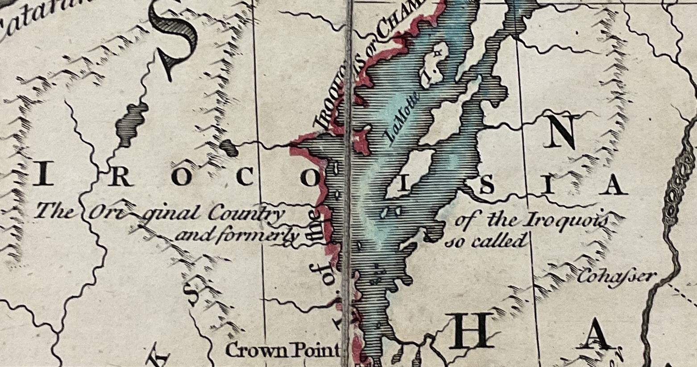
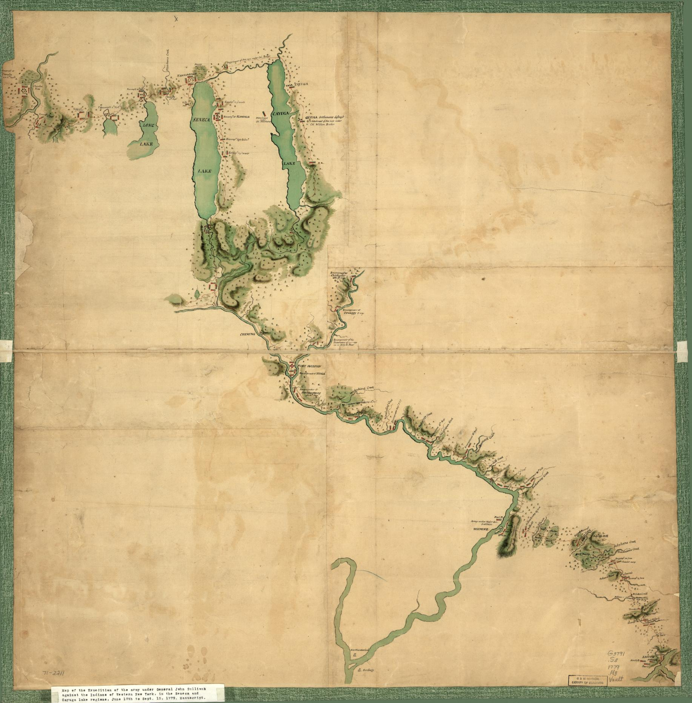
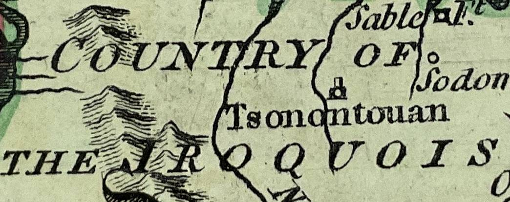
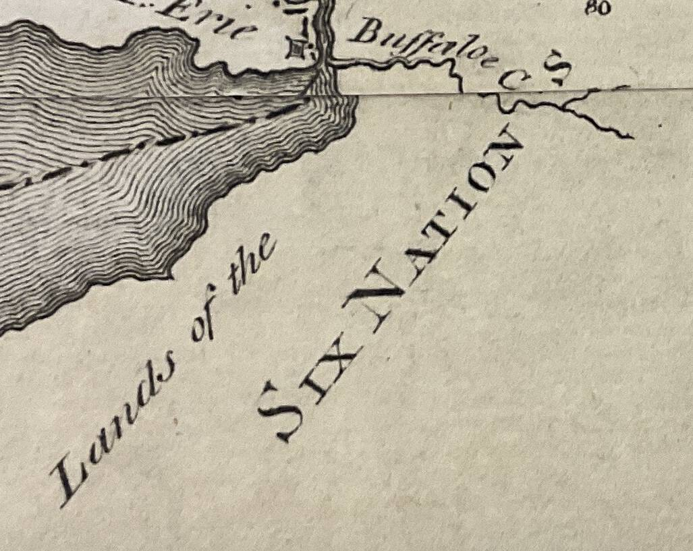

::: slide 5

## 1. Homelands

American history begins with the deep history of the land and its peoples as they existed long before the arrival of Europeans. British explorers were often professional soldiers who made coastal landings and moved up the dozens of rivers that led inland. They claimed possession of these spaces according to legal arguments that gave ownership of empty land to whoever occupied and ‘improved’ it. But they soon learned that the land was not empty. The Indigenous name of the place they called ‘Virginia’ is Tsenacommacah: the densely inhabited land.

:::

::: slide 6

The Indigenous landscape was more than a homeland: it was a site of creation. For the coastal Algonquian it was the Dawnland, for the Haudenosaunee it was Turtle Island – the place where everything had its beginning and its being. The land was a cultural and moral space, infused with fundamental beliefs, and overlayered with stories that were enacted, remembered, and shared among kin and with Europeans.

The sacred ties between land and people were recited in the Ohén:ton Karihwatéhkwen, the ‘words that come before all else’ that give thanks to the earth, waters, animals, plants, winds, the sun and stars. The maps shown here contained this environment, and the words of this address were an account of the relationship between peoples and the ecosystems that supported them.
:::

::: slide 7
**_Our Ancestors came out of this very Ground, and their Children have remained here ever since._**

The land was political. Haudenosaunee oral tradition drew the land and its history together in multiple versions of the story of the formation of the Great League of Peace, and where Deganawidah taught Hiawatha the rituals of the condolence ceremony. As the Onondaga diplomat Canasatego declared at a treaty council in 1744, ‘our Ancestors came out of this very Ground, and their Children have remained here ever since’.
:::

::: slide 8  
Indigenous peoples were map-makers, but these maps were carried in the mind and then sketched with charcoal on hide or bark, or drawn with a stick in soft soil or the ashes of a fire. Colonial officials copied these maps, which allow us to glimpse the ways in which Indigenous nations saw themselves in relation to other peoples. The famous Catawba deerskin map portrayed two contrasting ways of being on the land: the villages and towns of the Catawba are represented as a network of circles connected by paths, while the British colonial city of Charlestown is shown as a grid system of streets. The relative size of circles (a sacred shape in Indigenous culture) denotes the importance and power of each nation; the paths linking them represent connections of kinship, trade and alliance.

:::

::: slide 9  
_Haudenosaunee_ can be translated as the ‘whole house’, and their landsin what is now New York state were conceived as a metaphorical Longhouse with ‘doors’ facing east and west. The Seneca guarded the western door and the Mohawk the eastern one that faced toward the British colonies. Between them were the Cayuga, Onondaga and the Oneida. The longhouse and its nations are represented on the Hiawatha Belt that shows the nations of the Confederacy gathered under the Great Law. The central image of a white pine symbolises the tree of peace around which the nations shelter, and the location of the central council fire at Onondaga.

:::

::: slide 10  
British mapmakers took care in noting the positions of each nation and territorial extent of the Confederacy as a whole. In John Mitchell’s map of the British and French territories in North America, the label ‘Six Nations or Iroquois’ cuts across Virginia, Pennsylvania, New York, and north of the Great Lakes. Mitchell also identified the Haudenosaunee’s much smaller original homeland _Irocoisia_, centred on Lake Champlain.

:::

::: slide 11  
Yet this was not a wholly peaceful landscape. In response to the effects of European soldiers, traders and settlers the Haudenosaunee carried out campaigns against neighbouring nations, seeking captives and access to new hunting lands. In 1657, a missionary observed that the villages and towns of the Five Nations contained ‘more foreigners than natives of the country’. For the British, the Haudenosaunee were like themselves: an expanding commercial and military power that brought other nations under their control and, as allies of the Crown, into Britain’s imperial network. This myth of ‘Iroquois empire’ was used by the British to bolster their own power in interior spaces where Indigenous nations were fully sovereign.

:::

::: slide 12  
The United Colonies emerged as a new power in 1775 and sought diplomatic relations with the Haudenosaunee. However, the peoples of the longhouse divided over the conflict between Britain and her colonies: the Mohawk, Seneca, Onondaga, and the Cayuga remained allied to the Crown via the Covenant Chain. In 1779, George Washington planned a massive military operation ‘directed against the hostile tribes of the six nations of Indians, with their associates and adherents’. He continued that it was necessary to complete ‘the total destruction and devastation of their settlements’. Washington’s campaign was not a simple war of conquest, but a carefully planned engagement against nations who matched the United States’ political and military power.

:::

::: slide 13

The village worlds of the Haudenosaunee were broken apart. Thousands fled to the British stronghold at Fort Niagara, and the nations as whole experienced famine and displacement, their lands seized by the United States by the Treaty of Fort Stanwix (1784). But the Six Nations did not vanish. Early American maps positioned them on the western edges of expanded colonial spaces, not in reserved lands but in homelands that remain within the borders of New York state.

:::
