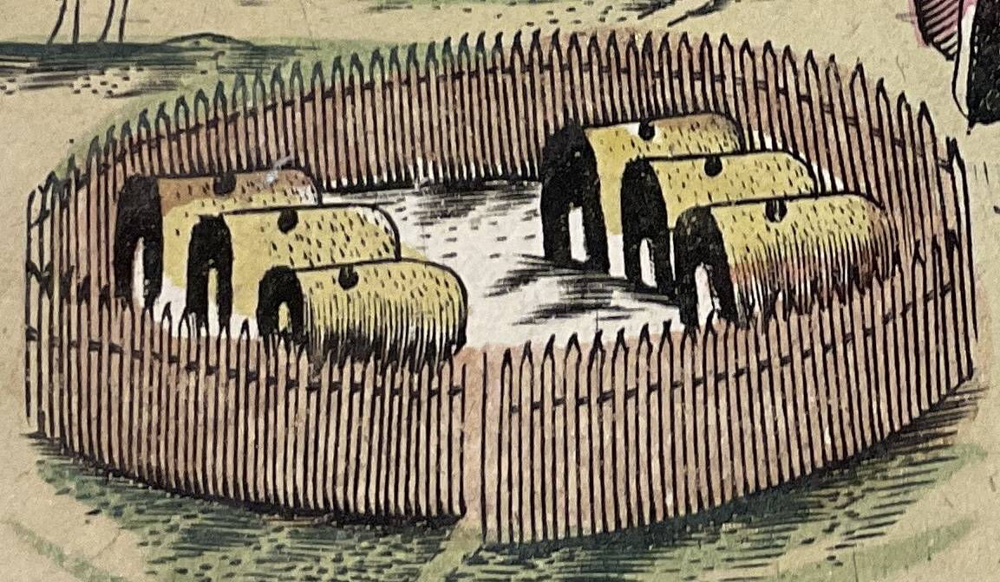
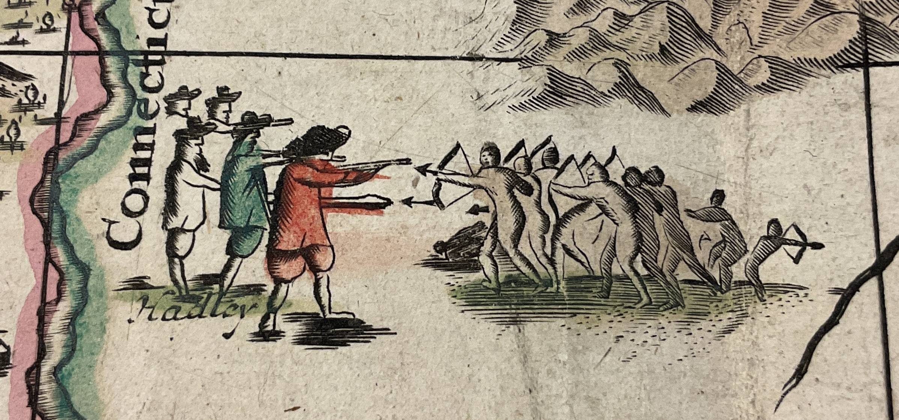
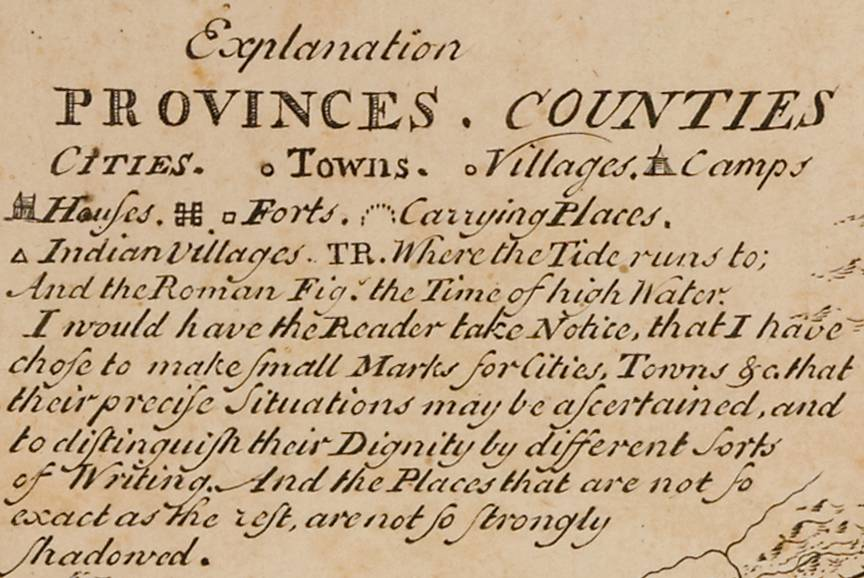
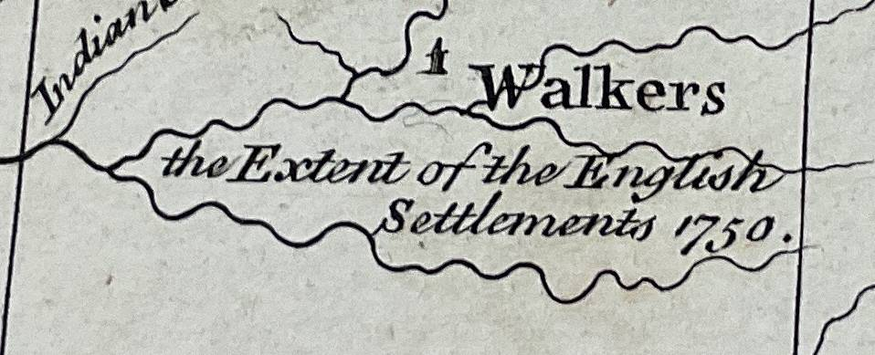
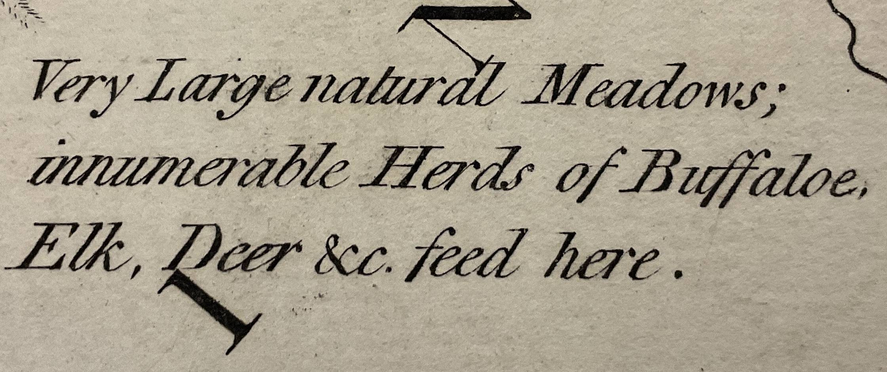
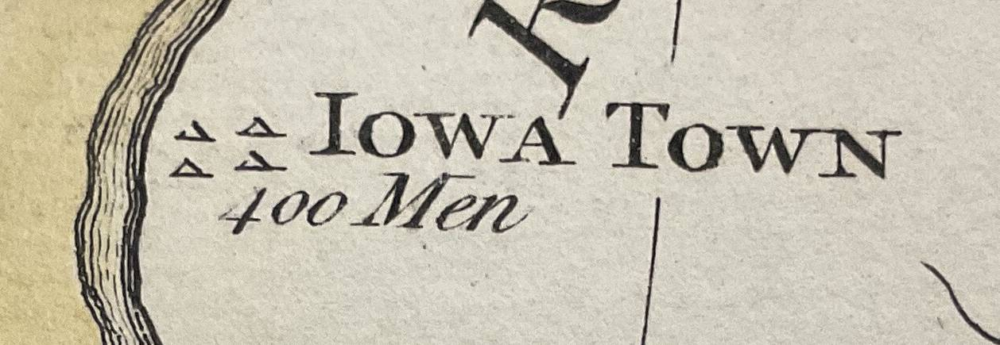

::: slide 20

European claims to the conquest of the ‘new world’ were primarily intellectual, based on ideas of political, cultural, racial and technological superiority. English writers debated how colonies should be ruled, but there was a deeper question of how they were ‘rightfully’ obtained. The law of nations, the precursor to modern international law, stipulated that powers could obtain lands outside their borders by means of conquest and occupation. According to the Swiss writer Emer de Vattel, ‘When a nation takes possession of a distant country, and settles a colony there’ then this territory ‘naturally becomes part of the state, equally with its ancient possessions’.

The experience of colonisation shaped British claims to the possession of territory. Writers on colonial affairs based the rightful possession of colonies on the argument that warfare with Indigenous sovereigns was the basis of ‘rightful’ conquest. Following wars between the Powhatan Confederacy and colonists in Virginia, Edward Waterhouse, secretary of the Virginia Company, stated the case for the annexation of Indigenous territory by war: ‘So that we, who have hitherto have had possession of no more ground then their waste . . . may now by right of Warre, and law of Nations, invade the Country, and destroy them who fought to destroy us: whereby we shall enjoy their cultivated places [which] shall now also be possessed entirely by us’. Over one hundred years later, William Blackstone recalled this and other conflicts and identified them as the basis of Britain’s territorial empire in North America. ‘Our American plantations [were] obtained in the last century either by a right of conquest or driving out the natives (with what natural justice I shall not at present enquire) or by treaties’.

:::

::: slide 21
**_The English settled among Indigenous nations._**

The English settled among Indigenous nations and were drawn into networks of trade and diplomacy – they entered these circuits of power as minor players, far fewer in number and faced with challenges of basic survival. Weakness, rather than strength, shaped their interactions with Indigenous nations. The maps that they produced sought to portray mastery of the landscape, but they also depicted Indigenous peoples as actors, living on and in the land and seemingly untroubled by the presence of the English.

John White’s _America Pars_ (1590) of Virginia employs a symbolic language to denote English power and the potential for mastery of the landscape. The first is the label of Virginia ‘now called for the first time in English’, that is superimposed on a map that, with one exception, contains exclusively Indigenous places. Each settlement is positioned and represented by a name and the figure of a palisade. White’s map also depicted English technological mastery and military supremacy, showing coasts lined with eight English ships that dwarf the four dugout canoes of the Powhatan.

:::

::: slide 22
A century after the creation of White’s map, English settlements in ‘New England’ extended inland as far as the Hudson River. Colonists found themselves in small enclaves surrounded by large and coherent Indigenous social formations. Rather than a separation and peoples and cultures, this region is characterised by proximity and intermingling: colonists would have seen Indigenous peoples daily, and this close connection amplified violence when it happened. Colonial governments sought to regulate the affairs of what they called ‘our Indians’, who lived within the ‘jurisdiction’ of colonial governments. In Virginia and New England, legislatures passed dozens of laws that restricted the political and cultural freedoms of Indigenous peoples. These measures led to widespread conflict in Virginia and New England. John Foster’s map of New England (1677) showed colonial towns in a landscape with only a handful of Indigenous placenames, creating the impression of a retreating Indigenous village world.

:::

::: slide 23
**_The Haudenosaunee were also settlers._**

The creation of new colonies disrupted the flows of Indigenous politics. Pennsylvania was established in 1681, and its presence broke the pattern of relations between the Delaware, Susquehannock and the Haudenosaunee. They found themselves at war with rival groups and caught up in the power struggle between colonies for control of trade and territory. One Mohawk speaker appealed to the Governor of New York in 1687: ‘Where can we run? There is a great crowd of Indians who would pursue us everywhere anyway’.

The Haudenosaunee moved villages every twelve years and chose locations that were both strategic and rich in resources: river valleys for settlement, uplands, and forests for hunting; these were managed by seasonal burning to clear undergrowth in order to create optimal habitats for large animals. All of this was happening far from the sight and experience of eastern colonies.

:::

::: slide 24
Settlers pushed out of towns and villages into the ‘back country’. Maps began to carry text blocks that identified the location of the best land, and left blank spaces for the formation of new colonies. Lewis Evans’ map of the western reaches of the middle colonies declared that, ‘This Country is finely improved to the Mountains; and the Inhabitants enjoying the Fruits of the Difficulty of first Settling. The Roads are very well accommodated’. Evans noted that ‘the Woods being yet so thick’ it was difficult to ‘fill those Parts where our Settlements and Discoveries have not yet extended to’. But Evans’ map did not erase Indigenous nations or their settlements. At the top centre of the map is Onondaga, ‘where the Gen. Council of the Confederate Republic of the Six Nations meets’. Anglophone settlement was confined to a belt that lay to the south of Haudenosaunee territory, which is bordered by the Blue Mountains and the upper reaches of the Delaware River.

:::

::: slide 25
As British traders, diplomats and settlers journeyed further west, mapmakers began to illustrate a ‘frontier’. Herman Moll’s map of the Crown’s ‘dominions’ offered a glimpse of the Continental interior, with settlements confined to the Atlantic coast and river valleys. Similarly, John Mitchell showed the western borders of colonies reaching toward the Mississippi and noted the ‘extent’ of English settlement in 1750 – which reached what is now Harlan County, Kentucky.

:::

::: slide 26  
Increasingly, maps portrayed colonies as parts of a larger British empire, while colonial officials proposed that they were increasingly independent from the Crown. Speaking before parliament in 1766, and recalling the Seven Years War, Benjamin Franklin noted the autonomy of colonies within the British empire: ‘They defended themselves, when they were but a handful, and the Indians much more numerous. The continually gained ground, and have driven the Indians over the mountains, without any assistance from this country’. In Franklin’s view, colonists were themselves the main drivers of Britain’s imperial expansion. Where maps of the seventeenth century marked colonial towns that had been cleared by Indigenous war parties, a century later this once contested ground was consolidated into neatly bordered colonies (on the verge of becoming states). Thomas Jeffries’ map of the ‘inhabited’ parts of New England included an illustration of the landing of the ‘Pilgrims’ at Plymouth in 1620, who were welcomed ashore by Liberty and an Indigenous sachem. Images like this formed the basis of a claim that the British acquired Indigenous territory peacefully, and were intended to mask the reality of inter-cultural violence.

:::

::: slide 27
Jefferies’ map is concerned with larger spaces, counties and townships that are based on ‘actual surveys’ and refined by scientific observation. Beyond these lines, there is a ‘west’, designated as ‘Part of New York’. This western region also appears at the centre of Thomas Hutchins’ 1778 map of the ‘western parts’ of the middle colonies, showing embryo states – Indiana and the Illinois Country, and offering commentary on the quality of land. On the western edge of the map, Indigenous towns are noted, each with its number of ready warriors.

:::

::: slide 28
Abraham Bradley’s _A Map of the United States_ shows territorial consolidation on an even larger scale, but the layering of landscapes is still present. The central council fire of Onondaga is clearly positioned above Canandaigua, Seneca and Cayuga Lakes. Yet this historically important centre of the Longhouse is shown captured within a neat range of townships and surrounded by place names drawn from classical and Anglophone sources. Bradley’s map presented a landscape being transformed by the creation of ordered lines of property, the extension of the jurisdiction of American government, the emergence of a new infrastructure of communication in the form of post roads.

:::

::: slide 29  
Bradley’s map shows state-driven colonialism that created the conditions for the free movement of settlers, and to constrain the movement of Native peoples. As John Adams noted in remarks on the basis of American power: ‘If you make enquiry into the circumstances of the different parts of America, at this day; you find the people in all the States pushing their settlements out into the wilderness, upon the frontiers, cutting down the woods, and subduing new lands, with as much eagerness and rapidity, as they used to do in former times of war or peace’.
:::
